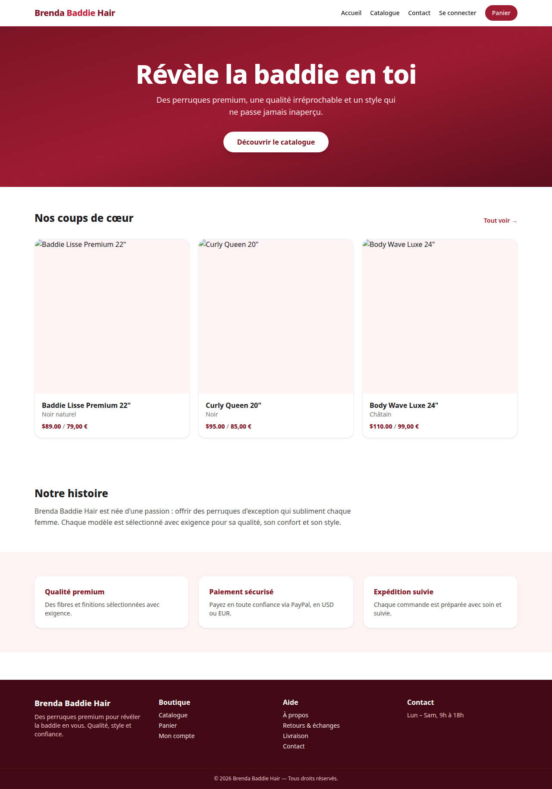
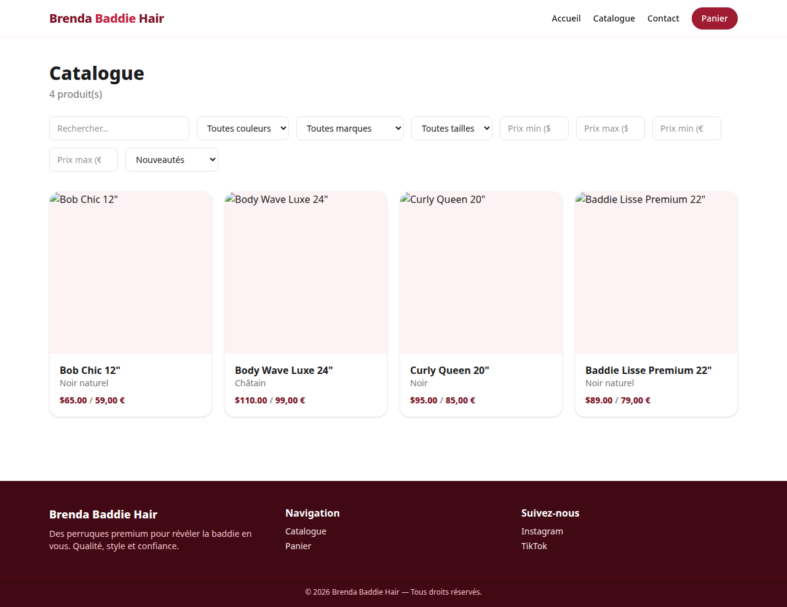
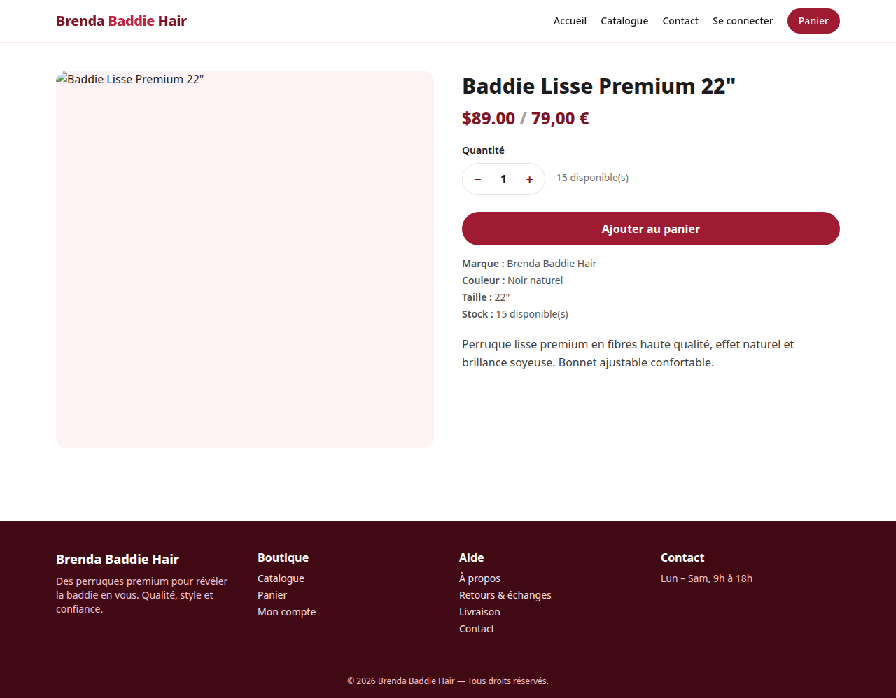
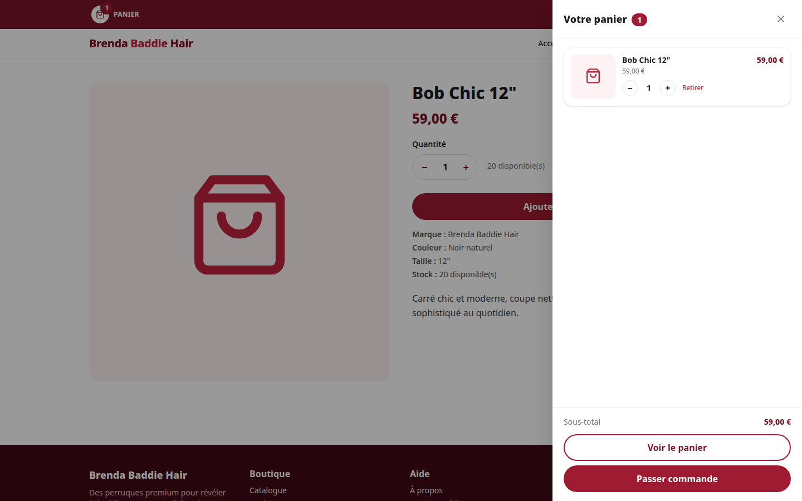
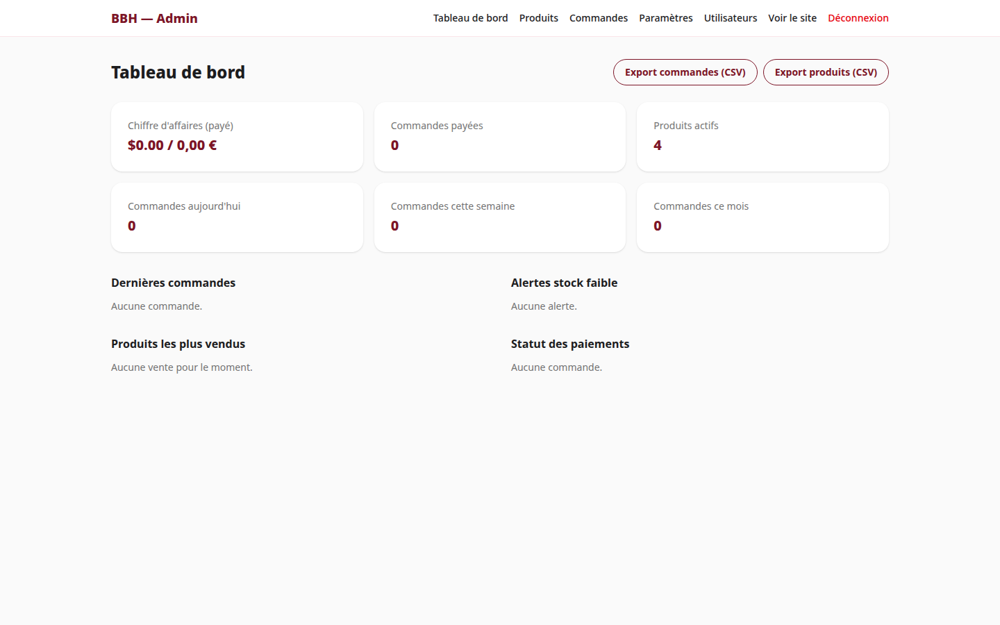
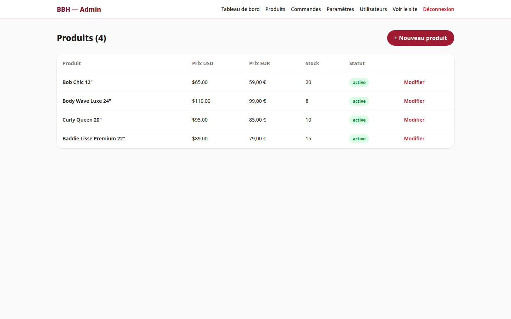
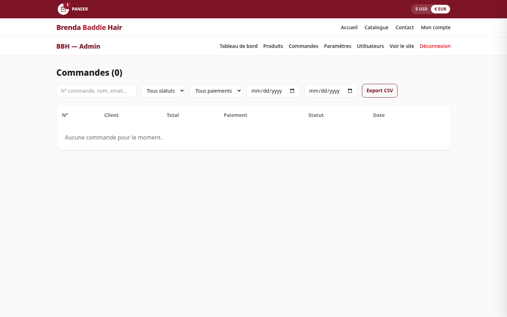

# Brenda Baddie Hair — E-commerce

Boutique en ligne de vente de perruques premium, développée en **Next.js 16** (App Router).

## Aperçu

| Accueil | Catalogue |
|---|---|
|  |  |

| Fiche produit | Mini-panier |
|---|---|
|  |  |

### Backoffice (`/admin`)

| Tableau de bord | Produits |
|---|---|
|  |  |

| Commandes |
|---|
|  |

> Captures générées le 23/09/2026 avec les données de démonstration (photos produits en attente des visuels définitifs).

## Fonctionnalités

### Boutique
- Page d'accueil (hero, produits vedettes)
- Catalogue avec filtres (recherche, couleur, marque, prix max, tri)
- Fiche produit (galerie, prix USD + EUR, stock, commande WhatsApp)
- Panier (localStorage)
- Commande : informations client + paiement **PayPal** (USD)
- Page de confirmation avec numéro de commande

### Backoffice (`/admin`)
- Tableau de bord : CA, commandes, alertes stock
- Produits : CRUD complet, prix USD/EUR saisis manuellement, upload photos, statuts
- Commandes : liste, détail, workflow de statut, transporteur + n° de suivi
- Authentification sécurisée (NextAuth + bcrypt)

## Démarrage

```bash
# 1. Installer
npm install

# 2. Configurer
cp .env.example .env
# → renseigner DATABASE_URL, AUTH_SECRET, clés PayPal

# 3. Base de données
npx prisma db push
npx prisma db seed

# 4. Lancer
npm run dev
```

Compte admin de démo : `admin@brendabaddiehair.com` / `admin123`

## Variables d'environnement

| Variable | Description |
|---|---|
| `DATABASE_URL` | SQLite local (`file:./dev.db`) ou Postgres en prod |
| `AUTH_SECRET` | Secret NextAuth (32+ caractères) |
| `PAYPAL_CLIENT_ID` / `PAYPAL_CLIENT_SECRET` | Clés PayPal (sandbox puis live) |
| `PAYPAL_MODE` | `sandbox` ou `live` |
| `NEXT_PUBLIC_PAYPAL_CLIENT_ID` | Clé publique PayPal (bouton front) |
| `NEXT_PUBLIC_WHATSAPP_NUMBER` | Numéro WhatsApp (bouton commande) |

## Production

```bash
npm run build
npm start
```

Base Postgres recommandée en production (`DATABASE_URL` pointant vers Postgres,
`provider = "postgresql"` dans `prisma/schema.prisma`).

## Spécifications

Voir le document de spécifications v1.0 (projet client Brenda S.).
